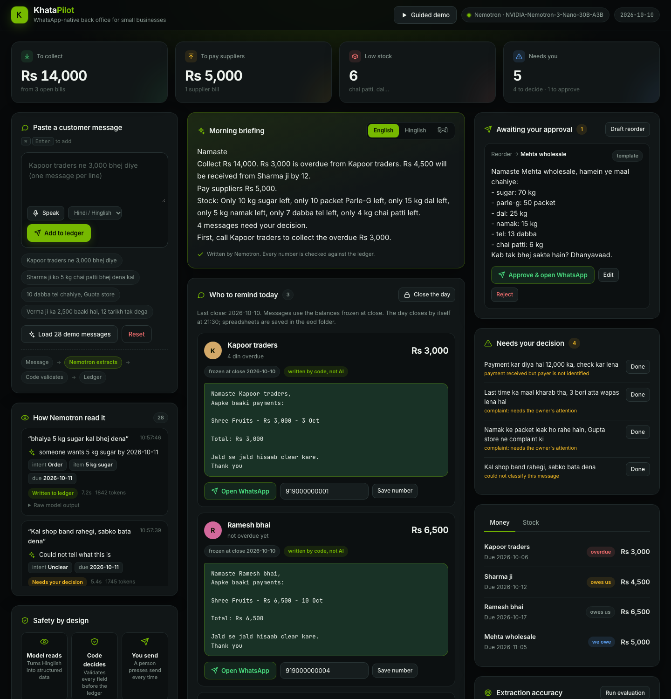
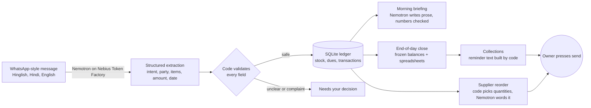

# KhataPilot: a back-office agent for Indian shops

> **WhatsApp in, ledger and briefing out, a human on every send.** KhataPilot reads Hinglish shop messages with NVIDIA
> Nemotron on Nebius Token Factory, keeps the books in code, and prepares the day's reminders and orders for the owner
> to approve. The model reads, code decides, the owner presses send.

Small shops and traders in India run on WhatsApp messages in Hinglish: *"Kapoor traders ne 3,000 bhej diye"*,
*"10 dabba tel chahiye, Gupta store"*, *"Mehta wholesale ko 8000 dena hai, 5 tarikh tak"*. The owner keeps the
rest in their head or in a paper khata.

KhataPilot reads those messages, keeps the ledger (stock, money owed to you, money you owe), and every morning
tells the owner what to do first: who to chase, what to reorder, what needs a decision. At the end of each day
it closes the books and writes an Excel-ready day book and outstanding sheet (CSV). The next morning each customer who owes money gets a
one-click WhatsApp reminder listing their unpaid bills. **A person presses send every time. Nothing is sent
automatically.**

Built for the Nebius x NVIDIA Global AI Hackathon. Hinglish is the hardest case of code-mixed language, so it is
the demo; the pipeline is language-agnostic and the briefing already switches between English, Hinglish and Hindi.



## How it works



The customer reminder is built by code from the end-of-day figures, with no model involved, because it contains money:

```
Namaste Kapoor traders,
Aapke baaki payments:

Shree Fruits - Rs 7,000 - 28 Sep
Shree Fruits - Rs 5,000 - 30 Sep

Total: Rs 12,000

Jald se jald hisaab clear kare.
Thank you
```

If a customer pays after the close, the screen shows "balance changed since close, check before sending" so nobody gets chased for money they already paid.

The design rule: **the model reads and writes language; code owns the numbers.**

- Extraction output is validated. Anything unclear (a payment with no named payer, a complaint, an unreadable
  message) goes to a "needs your decision" queue instead of the ledger.
- Hinglish details are handled explicitly, e.g. *"X **ne** 5,000 bhej diye"* (X paid us) versus
  *"X **ko** 5,000 bhej diye"* (we paid X), and relative dates (*kal*, *parso*, weekday names).
  When a party is already known as a customer or supplier, that overrides the model's guess about direction.
- Every rupee amount, quantity and date in a generated briefing or supplier message is checked against the ledger
  facts. If the model invents or changes a number, the text is discarded and a plain template is used.
- Reorder quantities are computed in code (top up to twice the reorder level); the model only words the message.

## What is in the dashboard

- **How Nemotron read it**: every message shows the model's reading in plain English, the extracted fields, latency, token
  count, the raw JSON, and what the code did with it (written, held, or sent to you).
- **Safety by design**: model reads, code decides, you send. Live counters, and "sent automatically" is always 0.
- **Extraction accuracy**: 48 hand-labelled Hinglish messages scored by `evalrun.py` (also behind the *Run evaluation*
  button): the 28 demo messages (`eval_set.json`) plus 20 written after the prompt was frozen (`eval_holdout.json`). See
  [Accuracy, honestly](#accuracy-honestly) below.
- **Nebius performance**: latency and tokens per message, tokens used, and cost per 1,000 messages
  (set `PRICE_IN_PER_M` and `PRICE_OUT_PER_M` in `settings.env` from the Token Factory price list).
- **Briefing in English, Hinglish or Hindi**, with every number checked against the ledger.
- **Voice input**: a Speak button (Hindi/Hinglish or English) fills the message box using the browser's speech recognition.
- **Charts**: how late the money owed to you is, and who owes the most.
- **Guided demo**: a 9-step tour that runs the real pipeline. Mobile layout with a bottom navigation bar.

## Accuracy, honestly

A message counts as correct only if intent, party, amount, direction and item names and quantities all match the label.

| Setup | Runs | Result |
|---|---|---|
| Nemotron + validation code, no grammar guards | 4 | 44 to 47 of 48 (91.7% to 97.9%); held-out set 17 to 19 of 20 |
| Same, plus two Hindi grammar guards | 3 | 48 of 48 every time |
| Same, reasoning switched off | 1 | 16 of 28 on the demo set (57%), about 7x faster |

How to read this:

- The model is not fully deterministic, so the score moves a little between runs. Use the range, not one lucky run.
- The two guards in `extract.py` encode fixed grammar rules (*"X **ne** ... bhej diye"* is a payment received; *"X ka N
  baaki hai"* is money owed to us). **We wrote them after seeing the misses, so 48/48 is partly in-sample.** The honest
  out-of-sample number is the model-alone range above.
- 48 messages is a small set. It shows the approach works and where it fails; it is not a production benchmark.
- Misses are wrong `direction` hints. For a party already in the ledger, code overrides direction from the party's
  recorded kind, so the books are not affected. For a brand-new party the hint is used and the owner sees it in the trace.
- Reasoning stays on for extraction (`EXTRACT_THINKING=on`) because accuracy fell to 57% with it off.

```bash
python evalrun.py     # reproduce from the terminal, prints per-set results and saves eval_results.json
```

## Data and privacy

- Everything lives on the computer running `app.py`: the ledger in `shop.db` (SQLite), day-close sheets in `eod/`,
  settings and the API key in `settings.env`. There is no cloud database and no login. These files are git-ignored.
- What leaves the machine: the text of each message goes to Nebius Token Factory for extraction, and the briefing and
  reorder prompts (ledger figures, party names) go there too. Nothing else is sent anywhere.
- WhatsApp is never called by the app. "Open WhatsApp" opens a `wa.me` link in your browser and the owner presses send.
- The server binds to `127.0.0.1` only and accepts JSON POSTs only. Do not expose it to the internet: there is no login.
- Voice input uses the browser's built-in speech recognition, which may process audio on the browser vendor's servers.
  KhataPilot itself never stores audio.
- The activity trace, latest briefing and performance counters are held in memory and reset when the app restarts.

## Questions we expect

**Why not just a spreadsheet, Tally or Vyapar?** Those need the owner to type every entry. KhataPilot starts from what
already exists: the messages. It is the data-entry layer plus the follow-up (who to chase, what to reorder).

**What stops the model from corrupting the books?** The model never writes to the database. It returns JSON that code
validates field by field; anything unclear goes to "Needs your decision". Money in reminders is built by code, and every
number in a model-written briefing is checked against the ledger before it is shown.

**What if the model is wrong but the output looks valid?** That is the real residual risk. Mitigations: grammar guards
for the known Hindi traps, known-party direction override, a trace the owner can inspect, and a 10-minute duplicate guard. We report the miss rate instead of hiding it (see above).

**What happens if someone pastes the same message twice?** Exact duplicates within 10 minutes are held for review
instead of being applied twice.

**Why Nemotron Nano and not something bigger?** Cost and latency per message matter for a shop, and Nano is
sufficient with validation around it. `BRIEFING_MODEL` lets you point briefings at a larger Nemotron; the dashboard shows
latency and tokens so the trade-off is visible.

**Why does extraction take seconds?** Reasoning is on, which is what makes Hinglish reliable (57% without it).
Messages are independent, so throughput scales with parallel requests; the eval runs 4 at a time.

**Do you fine-tune?** No. Few-shot prompting plus validation code, so there is no training data to collect or
privacy risk from it. Fine-tuning on a shop's own corrected entries is a natural next step.

**What about duplicate customer names or spelling variants?** Names are matched case- and spacing-insensitively and
an unknown name creates a new party automatically. Fuzzy matching ("Kapoor" vs "Kapur") is not built, so a spelling
variant becomes a second party today.

**Is WhatsApp integrated?** Deliberately not through the Business API. One-click links keep a human on every send,
which is the safety design, and avoid bulk-messaging policy risk.

**Does it scale beyond one shop?** Not yet: one shop, one machine, SQLite. The core (extract, validate, apply) is
stateless apart from the database, so moving to a hosted database and per-shop accounts is a storage change.

**What would you build next?** Invoice photos with a vision model, item-to-supplier mapping, WhatsApp Business API with
owner approval, server-side Hindi speech-to-text, and fine-tuning on corrected entries.

## Models

All inference runs on **Nebius Token Factory** (OpenAI-compatible API) using NVIDIA **Nemotron** models
(default: `Nemotron-3-Nano-30B-A3B`, pay-per-token). Set `BRIEFING_MODEL` to use a larger Nemotron for the
briefing and drafts.

## Run it

```bash
python -m venv .venv && source .venv/bin/activate
pip install -r requirements.txt
cp .env.example settings.env      # then fill in NEBIUS_API_KEY and TEXT_MODEL
python test_db.py                 # offline tests, no API key needed
python app.py                     # dashboard at http://127.0.0.1:8000
```

In the dashboard press **Guided demo**, or **Load 28 demo messages** to watch the ledger fill, then **Hinglish** for the briefing,
**Close the day** to freeze balances and write the spreadsheets (saved in `eod/`), and **Open WhatsApp** on a
customer in the Collections list. Set `SHOP_NAME` (the firm name on each bill line) and `EOD_TIME` (when the day
closes by itself, default 21:30) in `settings.env`.

Command-line versions of each step:

```bash
python ingest.py                  # run demo_messages.txt through Nemotron into shop.db
python narrate.py --lang hinglish # morning briefing
python eod.py                     # close today, write the spreadsheets
python drafts.py generate         # draft the supplier reorder message
python drafts.py review           # approve / edit / reject in the terminal
```

## Files

| File | Purpose |
|---|---|
| `extract.py` | Prompted structured extraction with Nemotron, retries on unusable output |
| `db.py` | SQLite ledger, validation, direction logic, payment allocation, briefing facts |
| `narrate.py` | LLM-written briefing with a number guard and plain fallback |
| `drafts.py` | Supplier reorder drafts with an approval queue |
| `eod.py` | End-of-day close, frozen balances, spreadsheets, customer reminder text, WhatsApp links |
| `app.py`, `dashboard.html` | Local dashboard (Python standard library only) |
| `evalrun.py`, `eval_set.json`, `eval_holdout.json` | Accuracy evaluation on 48 labelled messages, with a check of what reaches the ledger |
| `test_db.py` | Offline tests for the ledger, guards and approval flow |

## Limitations

- Text messages only. The vision Nemotron model is not available on pay-per-token endpoints, so invoice photos
  (OCR, then Nemotron to structure the text) are not built yet.
- The reorder message goes to the first supplier in the ledger; items are not yet mapped to suppliers.
- WhatsApp is not connected through the official API. "Open WhatsApp" opens a chat with the text filled in
  (a `wa.me` link) and the owner presses send, so there is no bulk sending and no bill file attachment: the bills
  are listed in the message text.
- Sales are tracked as quantities and stock. Amounts and bill dates come from "baaki hai" style messages;
  rate x quantity pricing per sale is not built yet.
- Single shop, single user, runs locally, no login.
- Evaluation set is small (48 messages) and written by us; see [Accuracy, honestly](#accuracy-honestly).
- Extraction takes a few seconds per message because reasoning is on.

## License

MIT
