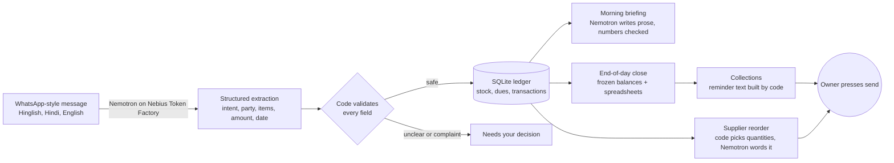

# KhataPilot: a back-office agent for Indian shops

Small shops and traders in India run on WhatsApp messages in Hinglish: *"Kapoor traders ne 3,000 bhej diye"*,
*"10 dabba tel chahiye, Gupta store"*, *"Mehta wholesale ko 8000 dena hai, 5 tarikh tak"*. The owner keeps the
rest in their head or in a paper khata.

KhataPilot reads those messages, keeps the ledger (stock, money owed to you, money you owe), and every morning
tells the owner what to do first: who to chase, what to reorder, what needs a decision. At the end of each day
it closes the books and writes Tally-style spreadsheets. The next morning each customer who owes money gets a
one-click WhatsApp reminder listing their unpaid bills. **A person presses send every time. Nothing is sent
automatically.**

Built for the Nebius x NVIDIA Global AI Hackathon.


## How it works



The customer reminder is built by code from the end-of-day figures, with no model involved, because it contains money:

```
Namaste Kapoor ji,
Aapke baaki payments:

Shree Fruits - Rs 7,000 - 28 Sep
Shree Fruits - Rs 5,000 - 30 Sep

Total: Rs 12,000

Jald se jald hisaab clear kare.
Thank you
```

If a customer pays after the close, the screen shows "balance changed since close, check before sending" so nobody gets chased for money they already paid.

The design rule: **the model reads and writes language; code owns the numbers.**

- Extraction output is validated. Anything unclear (a payment with no named payer, a complaint, an unreadable
  message) goes to a "needs your decision" queue instead of the ledger.
- Hinglish details are handled explicitly, e.g. *"X **ne** 5,000 bhej diye"* (X paid us) versus
  *"X **ko** 5,000 bhej diye"* (we paid X), and relative dates (*kal*, *parso*, weekday names).
  When a party is already known as a customer or supplier, that overrides the model's guess about direction.
- Every rupee amount, quantity and date in a generated briefing or supplier message is checked against the ledger
  facts. If the model invents or changes a number, the text is discarded and a plain template is used.
- Reorder quantities are computed in code (top up to twice the reorder level); the model only words the message.

## What is in the dashboard

- **How Nemotron read it**: every message shows the model's reading in plain English, the extracted fields, latency, token
  count, the raw JSON, and what the code did with it (written, held, or sent to you).
- **Safety by design**: model reads, code decides, you send. Live counters, and "sent automatically" is always 0.
- **Extraction accuracy**: 28 hand-labelled Hinglish messages in `eval_set.json`, scored by `evalrun.py`
  (also behind the *Run evaluation* button). Latest run: **27 of 28 correct (96.4%)**, avg 8 s per message with
  reasoning on, about 2.5 s when messages arrive one at a time. The one miss was a wrong `direction` hint.
- **Nebius performance**: latency and tokens per message, tokens used, and cost per 1,000 messages
  (set `PRICE_IN_PER_M` and `PRICE_OUT_PER_M` in `settings.env` from the Token Factory price list).
- **Briefing in English, Hinglish or Hindi**, with every number checked against the ledger.
- **Voice input**: a Speak button (Hindi/Hinglish or English) fills the message box using the browser's speech recognition.
- **Charts**: how late the money owed to you is, and who owes the most.
- **Guided demo**: a 9-step tour that runs the real pipeline. Mobile layout with a bottom navigation bar.

Reasoning stays on for extraction (`EXTRACT_THINKING=on`). Turning it off was about 7x faster but dropped accuracy
from 96% to 57% on the same set.

```bash
python evalrun.py     # reproduce the accuracy number from the terminal
```

## Models

All inference runs on **Nebius Token Factory** (OpenAI-compatible API) using NVIDIA **Nemotron** models
(default: `Nemotron-3-Nano-30B-A3B`, pay-per-token). Set `BRIEFING_MODEL` to use a larger Nemotron for the
briefing and drafts.

## Run it

```bash
python -m venv .venv && source .venv/bin/activate
pip install -r requirements.txt
cp .env.example settings.env      # then fill in NEBIUS_API_KEY and TEXT_MODEL
python test_db.py                 # offline tests, no API key needed
python app.py                     # dashboard at http://127.0.0.1:8000
```

In the dashboard press **Guided demo**, or **Load 28 demo messages** to watch the ledger fill, then **Hinglish** for the briefing,
**Close the day** to freeze balances and write the spreadsheets (saved in `eod/`), and **Open WhatsApp** on a
customer in the Collections list. Set `SHOP_NAME` (the firm name on each bill line) and `EOD_TIME` (when the day
closes by itself, default 21:30) in `settings.env`.

Command-line versions of each step:

```bash
python ingest.py                  # run demo_messages.txt through Nemotron into shop.db
python narrate.py --lang hinglish # morning briefing
python eod.py                     # close today, write the spreadsheets
python drafts.py generate         # draft the supplier reorder message
python drafts.py review           # approve / edit / reject in the terminal
```

## Files

| File | Purpose |
|---|---|
| `extract.py` | Prompted structured extraction with Nemotron, retries on unusable output |
| `db.py` | SQLite ledger, validation, direction logic, payment allocation, briefing facts |
| `narrate.py` | LLM-written briefing with a number guard and plain fallback |
| `drafts.py` | Supplier reorder drafts with an approval queue |
| `eod.py` | End-of-day close, frozen balances, spreadsheets, customer reminder text, WhatsApp links |
| `app.py`, `dashboard.html` | Local dashboard (Python standard library only) |
| `evalrun.py`, `eval_set.json` | Accuracy evaluation on 28 labelled messages, with a check of what reaches the ledger |
| `test_db.py` | Offline tests for the ledger, guards and approval flow |

## Limitations

- Text messages only. The vision Nemotron model is not available on pay-per-token endpoints, so invoice photos
  (OCR, then Nemotron to structure the text) are not built yet.
- The reorder message goes to the first supplier in the ledger; items are not yet mapped to suppliers.
- WhatsApp is not connected through the official API. "Open WhatsApp" opens a chat with the text filled in
  (a `wa.me` link) and the owner presses send, so there is no bulk sending and no bill file attachment: the bills
  are listed in the message text.
- Sales are tracked as quantities and stock. Amounts and bill dates come from "baaki hai" style messages;
  rate x quantity pricing per sale is not built yet.
- Single shop, single user, runs locally.

## License

MIT
